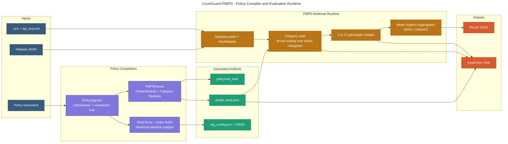
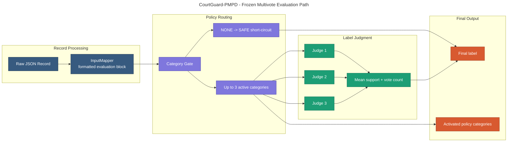

# CourtGuard-PMPD

CourtGuard-PMPD is a policy-grounded evaluation framework for safety judging and single-record classification. The repository centers on the **Prompt-based Modular Policy Database (PMPD)** workflow: a policy document is compiled into reusable modules, a broad category gate activates the relevant policy surface, and one or more lightweight judges produce a final policy-grounded verdict.

This workspace contains:

- the current CourtGuard-PMPD runtime and tests
- benchmark, manual-suite, and intra-domain adaptation datasets
- raw CourtGuard result files for GPT-OSS-20B and Ministral-3B
- the PMPD store variants used in the MLCommons adaptation study
- anonymous paper source for the current submission

The PMPD runtime is the primary path in this repository. The older retrieval-grounded debate path is retained only as a historical baseline implementation.

---

## Table of Contents

- [System Architecture](#system-architecture)
- [What CourtGuard Does](#what-courtguard-does)
- [Current Runtime Model](#current-runtime-model)
- [Policy Processing Pipeline](#policy-processing-pipeline)
- [How It Works](#how-it-works)
- [PMPD Mode in Detail](#pmpd-mode-in-detail)
- [RAG Mode in Detail](#rag-mode-in-detail)
- [Category Model](#category-model)
- [Project Structure](#project-structure)
- [Artifacts and Outputs](#artifacts-and-outputs)
- [Setup](#setup)
- [Configuration](#configuration)
- [Running the System](#running-the-system)
- [Inspection Workflow](#inspection-workflow)
- [Dataset Format](#dataset-format)
- [Evaluation Modes](#evaluation-modes)
- [Output Format](#output-format)
- [Test Suite](#test-suite)
- [Development](#development)
- [Anonymous Submission Bundle](#anonymous-submission-bundle)
- [Known Limits](#known-limits)
- [Citation](#citation)

---

## System Architecture





---

## What CourtGuard Does

CourtGuard supports two runtime modes:

- **`pmpd`**: the primary policy-grounded runtime used in the current experiments
- **`rag`**: a retrieval-grounded historical baseline retained in code for comparison

The PMPD workflow is designed for tasks where:

- each example can be represented as one structured record
- the decision rule can be grounded in a policy document
- the output is a policy-aware classification or adjudication result

This includes:

- jailbreak and refusal evaluation
- harmful-response judging
- toxicity or abuse assessment
- moderation of domain-specific text under custom policies
- other single-record governance tasks where labels depend on a written policy

---

## Current Runtime Model

The current repository is organized around the frozen PMPD multivote runtime.

### Core runtime behavior

- the policy is compiled into one global module and multiple category modules
- the category gate performs broad routing over the active category inventory
- if the gate returns no categories, the runtime emits `SAFE`
- if categories are activated, one or more lightweight judges evaluate the same record under compact PMPD guidance
- for multivote runs, the final label is selected by mean support and vote count

### Current experiment profiles

- **GPT-OSS-20B**: final PMPD configuration uses **1 judge**
- **Ministral-3B**: final PMPD configuration uses **3 judges**

These are the configurations reflected in the stored main benchmark, manual suite, and adaptation results.

---

## Policy Processing Pipeline

Before evaluation, CourtGuard transforms a source policy into reusable runtime artifacts.

### Processing stages

1. the policy document is ingested into a markdown tree
2. the markdown tree is parsed into PMPD modules
3. optional retrieval artifacts are built for the legacy RAG path
4. the compiled PMPD store becomes the runtime policy memory

### Main artifacts

- `CourtGuard/policy/md_tree/`
- `CourtGuard/pmpd_store.json`
- `CourtGuard/rag_config.json`
- `*_faiss/` for the legacy RAG baseline

The PMPD store is the main artifact for the current system.

---

## How It Works

At evaluation time, CourtGuard executes the following loop:

1. load one JSON record
2. map the requested input fields into a formatted evaluation block
3. render a compact routing view from the PMPD store
4. run the category gate
5. if no category activates, return `SAFE`
6. otherwise render a compact judge view and evaluate with `K` judges
7. aggregate the judge outputs into one final verdict
8. write the full result record, including categories, reasoning, timing, and token usage

---

## PMPD Mode in Detail

PMPD stands for **Prompt-based Modular Policy Database**.

It is both:

- a representation format for policy-grounded safety rules
- a runtime interface for building compact policy-aware prompts

### PMPD components

- **Global module**:
  - objective
  - core definitions
  - general evaluation principles
- **Category modules**:
  - short definitions
  - policy rules
  - exceptions
  - citations
  - few-shot or example traces where available

### Why PMPD matters

- it separates policy memory from model weights
- it allows category removal or replacement without retraining
- it supports explicit reasoning about which part of the policy is active
- it makes the adaptation study operational: swap the store, rerun the same evaluator

---

## RAG Mode in Detail

The retrieval-grounded debate path remains in the repository as a historical baseline.

It:

- retrieves top-k policy chunks from FAISS
- injects retrieved context into a debate prompt
- uses the older attacker / defender / judge structure

This path is still useful for baseline comparisons, but it is not the primary runtime discussed in the current PMPD study.

---

## Category Model

The PMPD runtime currently routes at the top-level category layer.

That means:

- the gate activates top-level categories
- judges inherit the activated category set from the gate
- subcategory detail is retained inside the PMPD modules for contextual guidance
- adaptation experiments are reported in the original MLCommons category space rather than internal PMPD numbering

For the current study, the main adaptation ladder removes the following softer MLCommons categories:

- `S5` Defamation
- `S6` Specialized Advice
- `S7` Privacy
- `S8` Intellectual Property

---

## Project Structure

```text
.
├── CourtGuard/
│   ├── bootstrap/
│   ├── core/
│   ├── data/
│   ├── debate/
│   ├── evaluation/
│   ├── infrastructure/
│   ├── ingestion/
│   ├── pmpd_pipeline/
│   ├── policy/
│   ├── prompts/
│   ├── rag/
│   ├── tests/
│   ├── evaluate.py
│   ├── inspect_pmpd.py
│   └── pmpd_store.json
├── courtguard_metrics/
├── papers/
│   └── courtguard_pmpd_emnlp/
├── scripts/
├── README.md
├── pyproject.toml
└── requirements.txt
```

This README focuses on the runtime, evaluation assets, and paper source used in the current PMPD study.

---

## Artifacts and Outputs

### Runtime data

- `CourtGuard/data/datasets/`
- `CourtGuard/data/manual_labeled_suite/`
- `CourtGuard/data/policy_adaptation/`
- `CourtGuard/data/results/`

### PMPD stores

- `archive/new_pmpd_stores/`
- `archive/pmpd_stores/`

### Paper source

- `papers/courtguard_pmpd_emnlp/`

### Evaluation utilities

- `courtguard_metrics/`
- `papers/results/paper_eval_tools/`

---

## Setup

### Python

- Python `3.11+` is recommended

### Install dependencies

```bash
pip install -r requirements.txt
```

### Environment

1. copy `.env.example` to `.env`
2. set `LLAMA_CLOUD_API_KEY`
3. set the model configuration you want to use
4. create `CourtGuard/api_keys.txt` from `CourtGuard/api_keys.example.txt`

Example:

```text
your-openrouter-key-1
your-openrouter-key-2
```

---

## Configuration

The most important settings are:

- `LLAMA_CLOUD_API_KEY`
- `COURTGUARD_BOOTSTRAP_MODEL`
- `COURTGUARD_DEBATE_MODEL`
- `COURTGUARD_PROMPT_STYLE`
- `COURTGUARD_USE_HARMONY_ROLES`
- `COURTGUARD_INPUT_FIELDS`

For PMPD multivote runs, the judge count is controlled through CLI flags:

- `--pmpd-runtime multivote`
- `--multivote-judges 1`
- `--multivote-judges 3`

---

## Running the System

Run from `CourtGuard/`.

### Main benchmark example

```bash
cd CourtGuard
python evaluate.py --mode pmpd --pmpd-runtime multivote --multivote-judges 1 --data_file "data/datasets/JAILJUDGE_ID.json" --indexes "0-299"
```

### Manual suite example

```bash
cd CourtGuard
python evaluate.py --mode pmpd --pmpd-runtime multivote --multivote-judges 1 --data_file "data/manual_labeled_suite/Puzzler_llama2-7b_SelfDefend-tuning-direct.json" --indexes "0-99"
```

### Intra-domain adaptation example

```bash
cd CourtGuard
python evaluate.py --mode pmpd --pmpd-runtime multivote --multivote-judges 3 --data_file "data/policy_adaptation/NEW_JAILJUDGE.json" --indexes "0-389"
```

---

## Inspection Workflow

To inspect the current PMPD store:

```bash
cd CourtGuard
python inspect_pmpd.py
```

For prompt-level inspection during evaluation:

```bash
cd CourtGuard
python evaluate.py --mode pmpd --inspect-pmpd --data_file "data/datasets/xstest_180.json" --indexes "0-0"
```

---

## Dataset Format

CourtGuard expects JSON records.

The runtime is input-field driven, so the same evaluator can operate on different record shapes as long as the required fields are provided through `InputMapper`.

Typical fields include:

- `user_prompt`
- `target model response`
- `message`
- `oldtext`
- `newtext`
- `diff`

---

## Evaluation Modes

### `pmpd`

- primary runtime for the current study
- category gating + lightweight judges
- supports policy adaptation by store replacement

### `rag`

- retrieval-grounded historical baseline
- kept for comparison and compatibility

---

## Output Format

Each evaluation writes one JSON result file containing per-record metadata such as:

- input record index
- final label
- activated categories
- reasoning text
- timing summary
- token usage
- runtime strategy metadata

The current PMPD result files are stored for:

- main benchmark runs
- manual suite runs
- policy adaptation runs

---

## Test Suite

Run:

```bash
pytest
```

Main test coverage areas include:

- prompt contracts
- PMPD prompt builders
- evaluation utilities
- retrieval and configuration helpers

---

## Development

Helpful commands:

```bash
black .
ruff check .
pytest
```

The paper source can be compiled from:

- `papers/courtguard_pmpd_emnlp/`

The anonymous bundle can be generated with:

```powershell
powershell -ExecutionPolicy Bypass -File .\scripts\prepare_submission_bundle.ps1
```

---

## Anonymous Submission Bundle

The repository includes a bundle-preparation script that creates a clean anonymous export in parallel, without touching the existing workspace history.

The generated bundle:

- excludes ancillary application-layer directories outside the PMPD submission scope
- excludes secrets and local caches
- excludes competitor raw-result folders
- includes only CourtGuard code, datasets, PMPD stores, CourtGuard raw outputs, and anonymous paper source
- writes a ready-to-initialize repository folder under `archive/submission_bundle/`

This is the folder intended for a fresh GitHub initialization.

---

## Known Limits

- benchmark coverage and policy coverage are not identical
- the category gate is the main source of structural false negatives on mismatched benchmarks
- smaller backbones may need more judges to remain competitive
- competitor token-cost comparisons are necessarily approximate when external methods do not expose provider-level billing traces

---

## Citation

The anonymous paper source for the current PMPD submission is included under:

- `papers/courtguard_pmpd_emnlp/`

Public citation metadata can be added after review.
